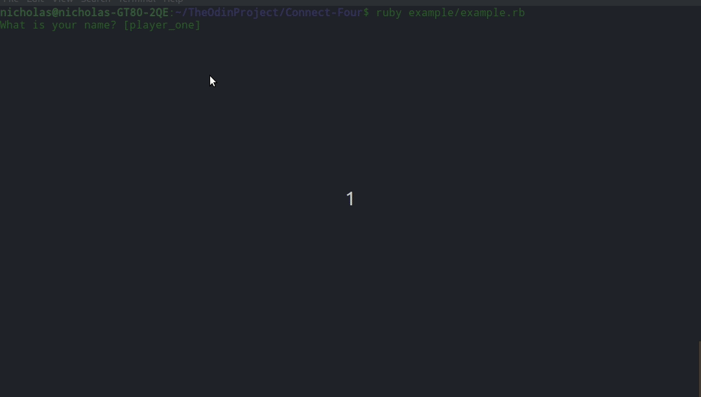

# Connect Four

Connect Four built using Test Driven Development.

[Link to repl.it](https://repl.it/@NicholasBerube/Connect-Four#readme.md)

## Demo



## Features

<ul>
  <li>Fully tested using RSpec</li>
</ul>

## Installation

- Clone the repo locally. ([Instructions](https://docs.github.com/en/github/creating-cloning-and-archiving-repositories/cloning-a-repository-from-github/cloning-a-repository))

- `cd Connect-Four` into the directory.

- And then execute:

```ruby
$ bundle install
```
